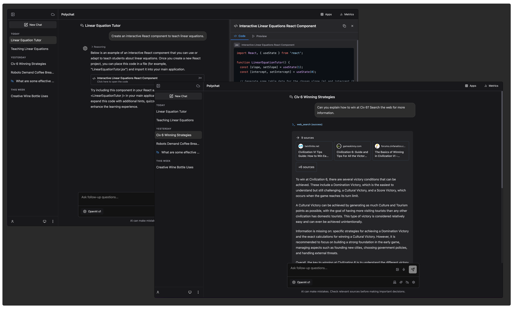

# AI Platform

A complete AI platform that makes multiple models available from a single application. It features an API platform that has been built out to provide a range of AI interactions and applications alongside a React frontend and a mobile application (in development).

Check out my write up on this project [here](https://nicholasgriffin.dev/blog/building-my-own-ai-assistant). I've also launched a version of this to try out at [polychat.app](https://polychat.app).

> [!NOTE]
> Please note that this project is still in active development so there are a few features that are not yet fully working or fully imagined.
> You can check out our todo list [here](https://github.com/nicholasgriffintn/personal-ai-assistant/issues/83).



## Project Structure

This project is organized as a monorepo with multiple applications:

- **app** - Web and mobile frontend application built with React, TailwindCSS, and React Router
- **api** - Backend API built with Cloudflare Workers that interfaces with AI models and manages user data
- **database** - Shared database schema and migrations using Drizzle ORM
- **metrics** - Analytics and monitoring application to track usage and performance

## Features

- API structure designed to match the OpenAI API for easy integration with various SDKs and applications.
- Multiple provider and model support
  - Anthropic
  - Bedrock
  - DeepSeek
  - OpenAI
  - Google AI Studio
  - Grok
  - Groq
  - Hugging Face
  - Mistral
  - OpenRouter
  - Perplexity
  - Replicate
  - Cloudflare AI
  - Ollama
  - Github Models
  - Together AI
- [An AI assisted podcasting app](https://nicholasgriffin.dev/blog/launching-an-automated-podcasting-app)
- [Drawing to painting and guessing the drawing app](https://nicholasgriffin.dev/blog/anyone-can-draw)
- Llamaguard Guardrails Support
- [Bedrock Guardrails Support](https://nicholasgriffin.dev/blog/protecting-content-with-aws-bedrock-guardrails)
- [Benchmarking](https://nicholasgriffin.dev/blog/building-a-tool-to-benchmark-ai)
- [RAG with Vectorize](https://nicholasgriffin.dev/blog/adding-rag-to-my-ai-assistant)
- [Automated model routing](https://nicholasgriffin.dev/blog/building-a-first-party-prompt-router)
- [Bedrock Knowledge Bases](https://nicholasgriffin.dev/blog/trying-out-bedrock-knowledge-bases)
- Prompt Coaching
- Monitoring with Cloudflare Analytics Engine
- Media uploading to Cloudflare R2
- Multiple authentication methods:
  - GitHub OAuth
  - Session-based authentication
  - JWT authentication
  - API token authentication
- A frontend application built with React and TailwindCSS
  - Uses the API app for authentication and AI requests
  - Retrieves and displays conversations and makes it easy to create new ones
  - Has the option to store conversations locally in IndexedDB or in LocalStorage (if IndexedDB is not supported)
  - Set chat titles and delete chats
  - Configure settings and models
  - [Web LLM](https://github.com/mlc-ai/web-llm) support for completely offline usage
- The API is deployed as a Cloudflare Worker and the frontend is deployed with Cloudflare Assets

## Setup and Installation

### Getting Started

1. Clone the repository
2. Install dependencies
   ```bash
   pnpm install
   ```

3. Configure environment variables:
   - Copy `.dev.vars.example` to `.dev.vars` in all the apps directories that have them.
   - Copy `wrangler.jsonc.example` to `wrangler.jsonc` in all the apps directories that have them.
   - Adjust with your API keys and configuration values.

4. Start the development servers:
   ```bash
   # Start all apps in development mode
   pnpm run dev
   
   # Or start individual apps
   pnpm run dev:app
   pnpm run dev:api
   pnpm run dev:metrics
   ```

### Deployment

The applications are designed to be deployed to Cloudflare:

```bash
# Deploy all applications
npm run deploy

# Deploy individual applications
npm run deploy:app
npm run deploy:api
npm run deploy:metrics
```

## API Documentation

### Authentication Flow

1. User initiates login by visiting: `https://api.polychat.app/auth/github`
2. User is redirected to GitHub to authorize the application
3. After authorization, GitHub redirects back to `https://api.polychat.app/auth/github/callback`
4. The API creates or updates the user record and generates a session
5. User is redirected back to the specified `redirect_uri` with a session cookie set
6. The application can choose to use the session cookie or generate a JWT token

### Using the Authentication

The authentication system uses HTTP cookies for session management. When a user successfully authenticates, a `session` cookie is set with the session ID.

For API requests, the session ID can be included in one of these ways:

1. Automatically via the session cookie (for browser-based requests)
2. As a Bearer token in the Authorization header:
   ```
   Authorization: Bearer your_session_id
   ```

### User Information

To get information about the authenticated user, make a GET request to `/auth/me`. This endpoint will use the session cookie or Authorization header to identify the user.

### Generating a JWT Token

To generate a JWT token for the authenticated user, make a POST request to `/auth/token`. This endpoint will use the session cookie or Authorization header to identify the user.

The JWT token will be returned in the response body and can then be used to make API requests to the other endpoints.

### Logging Out

To log out, make a POST request to `/auth/logout`. This will invalidate the session and clear the session cookie. 

## AI Model Integration

The application supports multiple AI providers through a unified API interface. To use a specific provider:

1. Configure the API keys in your environment variables
2. Select the provider and model in the frontend settings or specify them in API requests

Example API request:
```json
POST /chat/completions
{
  "model": "gpt-4",
  "messages": [
    {"role": "system", "content": "You are a helpful assistant."},
    {"role": "user", "content": "Hello world!"}
  ]
}
```

## Database Management

The application uses a Cloudflare D1 database with Drizzle ORM for schema management and migrations.

### Running Migrations

```bash
cd apps/database
# Migrate to the local database
pnpm run db:migrate:local

# Migrate to the preview database
pnpm run db:migrate:preview

# Migrate to the production database
pnpm run db:migrate:prod
```

To generate a new migration, run:

```bash
pnpm run db:generate
```

## Monitoring and Analytics

The metrics application provides dashboards for monitoring:

- API usage and performance
- Model performance and costs
- User activity and engagement

Access the metrics dashboard at [metrics.polychat.app](https://metrics.polychat.app).

## Mobile Application

> [!NOTE]
> The mobile application is not yet fully developed and is not ready for use.

The project includes a mobile application built with Capacitor:

```bash
# Build the web app
cd apps/app
npm run build

# Add mobile platforms
npx cap add ios
npx cap add android

# Sync web code to mobile projects
npx cap sync

# Open in native IDEs
npx cap open ios
npx cap open android
```

## Contributing

Contributions are welcome! Please feel free to submit a Pull Request.

## License

This project is licensed under the terms of the license included in the repository.
